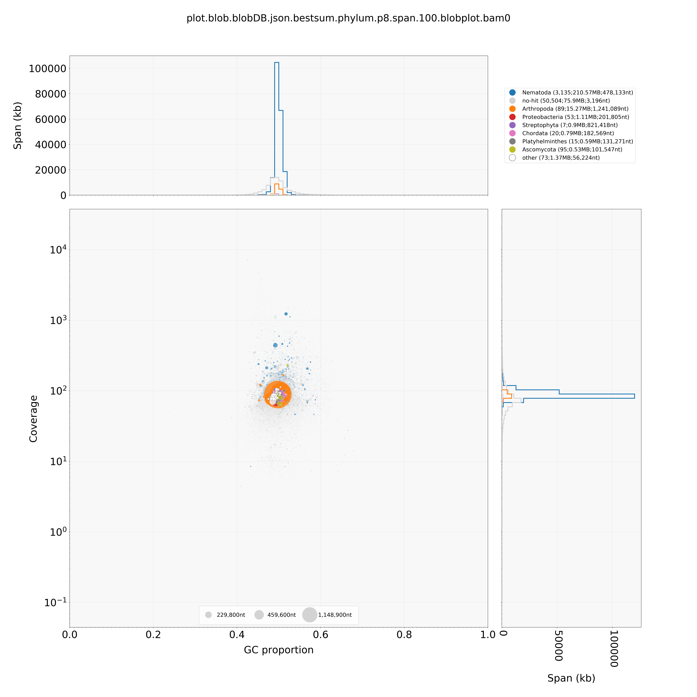
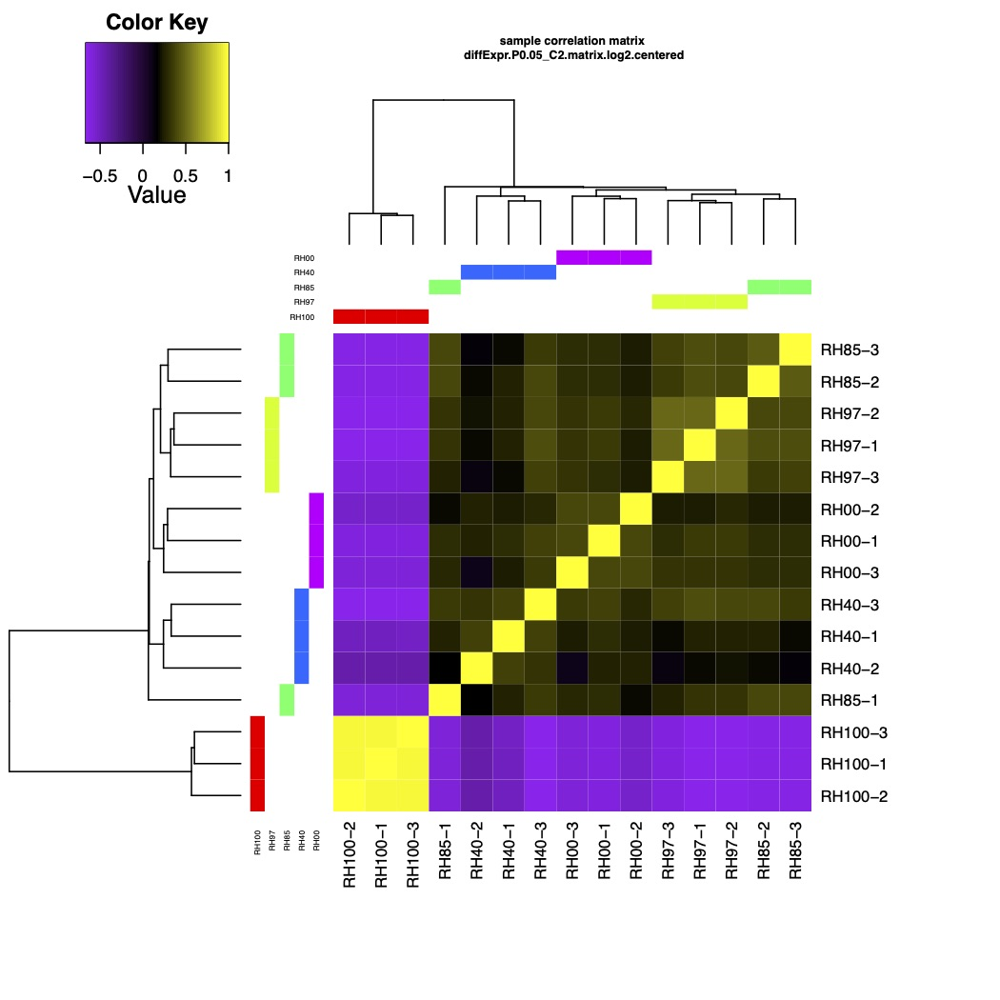
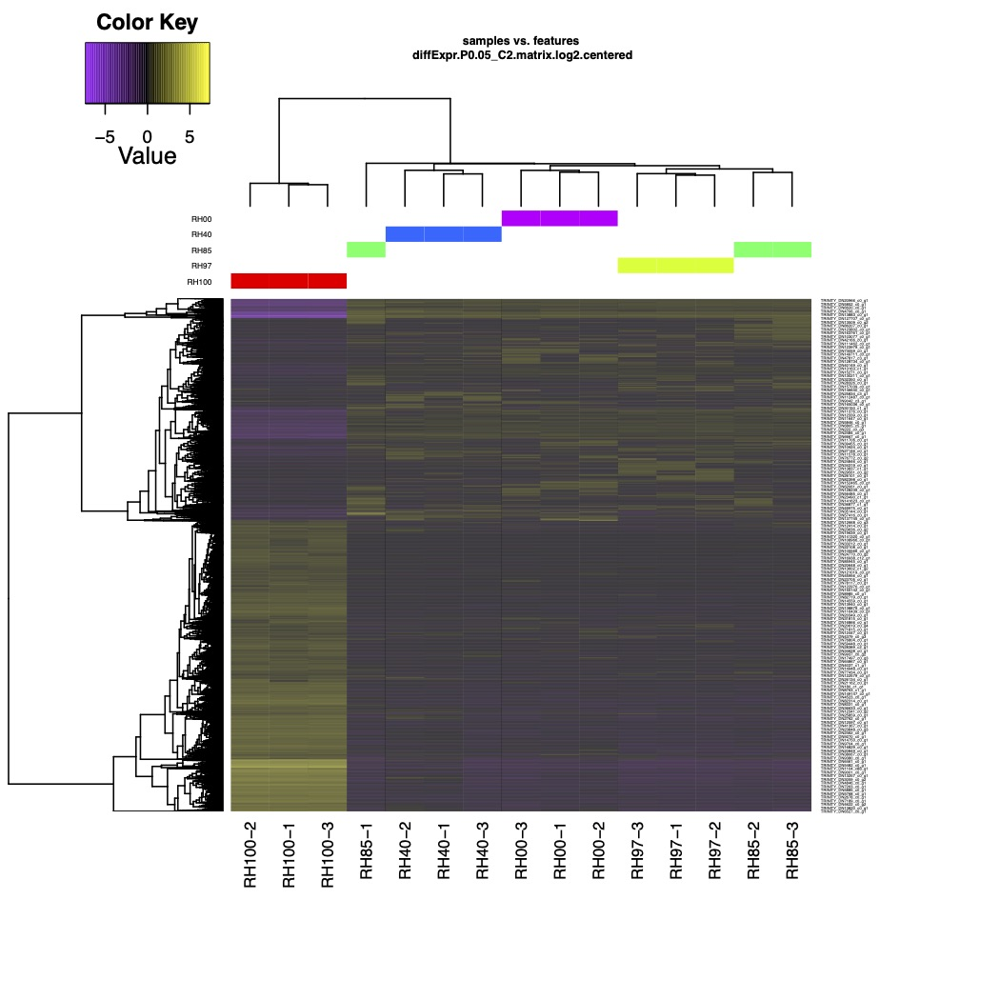

# Introduction
- I currently work on Tardigrade anhydrobiosis, and was looking for anhydrobiosis expression data of other organisms when I came across Aphelenchus avenae.
- There were no genome/transcriptome assemblies and papers assosiated with this study, so I presumed that 1) no one is analyzing the data, or 2) The paper is under submission (sequenced at 2014, is taking a very long time..). I wanted to see gene conservations, so I tried to assemble the genome with recent methods.
- I do not intend to write a paper on this data. It is soarly for my own practice in Bioinformatics.
- The C-value of A. avenae is [0.04pg](http://www.genomesize.com/result_species.php?id=5818), corresponding to 39.12Mbp.

# Method
## Software installation
- Normally, I install by manual ./configure && make && make install, but I wanted to test anaconda
- I created several envs (ie busco3, busco4, braker1, trinotate)

## Data Acquisition
- Sequence data list
  - DNA-Seq data from [PRJNA236621](https://www.ncbi.nlm.nih.gov/bioproject/PRJNA236621)
    - Illumina short insert DNA-Seq data
      ```
      SRX478896: Illumina reads (100bp paired)
      SRX476023: Illumina reads (75bp paired x 2 libraries)
      ```
    - Mate pair
      ```
      SRX476036: 454 8 kb paired end reads
      SRX476031: 454 20 kb paired end reads
      ```
  - RNA-Seq data from [PRJNA236622](https://www.ncbi.nlm.nih.gov/bioproject/PRJNA236622)
    ```
    SRR1174913	mRNA-RH100-1
    SRR1175676	mRNA-RH100-2
    SRR1175692	mRNA-RH100-3
    SRR1175695	mRNA-RH97-1
    SRR1175696	mRNA-RH97-2
    SRR1175697	mRNA-RH97-3
    SRR1175706	mRNA-RH85-1
    SRR1175707	mRNA-RH85-2
    SRR1175708	mRNA-RH85-3
    SRR1175729	mRNA-RH40-1
    SRR1175731	mRNA-RH40-2
    SRR1175736	mRNA-RH40-3
    SRR1175737	mRNA-RH0-1
    SRR1175739	mRNA-RH0-2
    SRR1175740	mRNA-RH0-3
    ```
- Data Acquisition
  - Downloading (sratools v2.9.2)
    - prefetch (download .sra)
    - fastq-dump (sra -> fastq, `--split-files --defline-seq '@$sn[_$rn]/$ri'`, --defline-seq is required for Trinity)
  - Data filtering
    - There were DNA-Seq reads that pairs could not be found in several DNA-Seq data, so I used fastq-pair to filter the data
      -  https://github.com/linsalrob/fastq-pair/blob/master/CITATION.md
      - /path/to/fastq-pair/build/fastq_pair SRX476031.sra_2.fastq SRX476031.sra_4.fastq
## Softwares
- Just a list of softwares that I use several times.
	```
	% augustus --version
	AUGUSTUS (3.3.3) is a gene prediction tool
	written by M. Stanke, O. Keller, S. König, L. Gerischer and L. Romoth.

	% bamtools --version
	bamtools 2.4.1
	Part of BamTools API and toolkit
	Primary authors: Derek Barnett, Erik Garrison, Michael Stromberg
	(c) 2009-2012 Marth Lab, Biology Dept., Boston College

	% samtools --version
	samtools 1.4
	Using htslib 1.4

	% bowtie2 --version
	/home/yuki.yoshida/bin/bowtie2-2.3.5.1-linux-x86_64/bowtie2-align-s version 2.3.5.1

	% blat
	blat - Standalone BLAT v. 36x4 fast sequence search command line tool

	% blastall
	blastall 2.2.22   arguments:blastall

	% bwa
	Program: bwa (alignment via Burrows-Wheeler transformation)
	Version: 0.7.12-r1039
	Contact: Heng Li <lh3@sanger.ac.uk>
	Copyright (C) 2017 Genome Research Ltd.

	% perl --version
	This is perl, v5.10.1 (*) built for x86_64-linux-thread-multi

	% G
		     __/__/__/__/__/__/__/__/__/__/__/__/__/__/__/__/__/__/__/__/__/

			   G-language  Genome Analysis Environment v.1.9.1


				     http://www.g-language.org/

		      Please cite:
			 Arakawa K. et al. (2003) Bioinformatics.
			 Arakawa K. et al. (2006) Journal of Pestice Science.
			       Arakawa K. et al. (2008) Genes, Genomes and Genomics.

		      License: GNU General Public License
		      Copyright (C) 2001-2016 G-language Project
		      Institute for Advanced Biosciences, Keio University, JAPAN

		     __/__/__/__/__/__/__/__/__/__/__/__/__/__/__/__/__/__/__/__/__/
	```

## Genome assembly
- There are many genome assemblers available, I used two famous softwares to test if there are any differences.
- SPADES v3.14.0
  ```
  ~/bin/SPAdes-3.14.0-Linux/bin/spades.py \
    --pe-1 1 SRR1180010.1.sra_1.fastq \
    --pe-2 1 SRR1180010.1.sra_2.fastq \
    --pe-1 2 SRR1176881.sra_1.fastq.paired.fq \
    --pe-2 2 SRR1176881.sra_2.fastq.paired.fq \
    --pe-1 3 SRR1179837.sra_1.fastq \
    --pe-2 3 SRR1179837.sra_2.fastq \
    --mp-1 2 SRX476031.sra_2.fastq.paired.fq \
    --mp-2 2 SRX476031.sra_4.fastq.paired.fq \
    --mp-1 3 SRR1176816.sra_2.fastq.paired.fq \
    --mp-2 3 SRR1176816.sra_4.fastq.paired.fq \
    -o Aphelenchus_avenae_spades -t 64
  ```
- MaSuRCA v3.3.5
  - Commands
    ```
    % /path/to/MaSuRCA-3.3.5/bin/masurca -g 
    # edit configureation file as shown below
    % /path/to/MaSuRCA-3.3.5/bin/masurca config.txt
    % ./assemble.sh
    ```
  - Config.file
    ```
    # example configuration file

    # DATA is specified as type {PE,JUMP,OTHER,PACBIO} and 5 fields:
    # 1)two_letter_prefix 2)mean 3)stdev 4)fastq(.gz)_fwd_reads
    # 5)fastq(.gz)_rev_reads. The PE reads are always assumed to be
    # innies, i.e. --->.<---, and JUMP are assumed to be outties
    # <---.--->. If there are any jump libraries that are innies, such as
    # longjump, specify them as JUMP and specify NEGATIVE mean. Reverse reads
    # are optional for PE libraries and mandatory for JUMP libraries. Any
    # OTHER sequence data (454, Sanger, Ion torrent, etc) must be first
    # converted into Celera Assembler compatible .frg files (see
    # http://wgs-assembler.sourceforge.com)
    DATA
    #Illumina paired end reads supplied as <two-character prefix> <fragment mean> <fragment stdev> <forward_reads> <reverse_reads>
    #if single-end, do not specify <reverse_reads>
    #MUST HAVE Illumina paired end reads to use MaSuRCA
    PE= p1 500 50 /path/to/data/SRR1180010.1.sra_1.fastq /path/to/data/SRR1180010.1.sra_2.fastq
    PE= p2 500 50 /path/to/data/SRR1176881.sra_1.fastq.paired.fq /path/to/data/SRR1176881.sra_2.fastq.paired.fq
    PE= p3 500 50 /path/to/data/SRR1179837.sra_1.fastq /path/to/data/SRR1179837.sra_2.fastq
    #Illumina mate pair reads supplied as <two-character prefix> <fragment mean> <fragment stdev> <forward_reads> <reverse_reads>
    #JUMP= sh 3600 200  /FULL_PATH/short_1.fastq.paired.fq  /FULL_PATH/short_2.fastq.paired.fq
    JUMP= j1 20000 1000 /path/to/data/SRX476031.sra_2.fastq.paired.fq /path/to/data/SRX476031.sra_4.fastq.paired.fq
    JUMP= j2 8000 500 /path/to/data/SRR1176816.sra_2.fastq.paired.fq /path/to/data/SRR1176816.sra_4.fastq.paired.fq
    #pacbio OR nanopore reads must be in a single fasta or fastq file with absolute path, can be gzipped
    #if you have both types of reads supply them both as NANOPORE type
    #PACBIO=/FULL_PATH/pacbio.fa
    #NANOPORE=/FULL_PATH/nanopore.fa
    #Other reads (Sanger, 454, etc) one frg file, concatenate your frg files into one if you have many
    #OTHER=/FULL_PATH/file.frg
    #synteny-assisted assembly, concatenate all reference genomes into one reference.fa; works for Illumina-only data
    #REFERENCE=/FULL_PATH/nanopore.fa
    END

    PARAMETERS
    #PLEASE READ all comments to essential parameters below, and set the parameters according to your project
    #set this to 1 if your Illumina jumping library reads are shorter than 100bp
    EXTEND_JUMP_READS=0
    #this is k-mer size for deBruijn graph values between 25 and 127 are supported, auto will compute the optimal size based on the read data and GC content
    GRAPH_KMER_SIZE = auto
    #set this to 1 for all Illumina-only assemblies
    #set this to 0 if you have more than 15x coverage by long reads (Pacbio or Nanopore) or any other long reads/mate pairs (Illumina MP, Sanger, 454, etc)
    USE_LINKING_MATES = 0
    #specifies whether to run the assembly on the grid
    #USE_GRID=1
    #specifies grid engine to use SGE or SLURM
    #GRID_ENGINE=SGE
    #specifies queue (for SGE) or partition (for SLURM) to use when running on the grid MANDATORY
    #GRID_QUEUE=all.q
    #batch size in the amount of long read sequence for each batch on the grid
    #GRID_BATCH_SIZE=500000000
    #use at most this much coverage by the longest Pacbio or Nanopore reads, discard the rest of the reads
    #can increase this to 30 or 35 if your reads are short (N50<7000bp)
    LHE_COVERAGE=25
    #set to 0 (default) to do two passes of mega-reads for slower, but higher quality assembly, otherwise set to 1
    MEGA_READS_ONE_PASS=0
    #this parameter is useful if you have too many Illumina jumping library mates. Typically set it to 60 for bacteria and 300 for the other organisms
    LIMIT_JUMP_COVERAGE = 300
    #these are the additional parameters to Celera Assembler.  do not worry about performance, number or processors or batch sizes -- these are computed automatically.
    #CABOG ASSEMBLY ONLY: set cgwErrorRate=0.25 for bacteria and 0.1<=cgwErrorRate<=0.15 for other organisms.
    CA_PARAMETERS =  cgwErrorRate=0.15
    #CABOG ASSEMBLY ONLY: whether to attempt to close gaps in scaffolds with Illumina  or long read data
    CLOSE_GAPS=1
    #auto-detected number of cpus to use, set this to the number of CPUs/threads per node you will be using
    NUM_THREADS = 64
    #this is mandatory jellyfish hash size -- a safe value is estimated_genome_size*20
    #JF_SIZE = 200000000
    JF_SIZE=6644521840
    #ILLUMINA ONLY. Set this to 1 to use SOAPdenovo contigging/scaffolding module.  Assembly will be worse but will run faster. Useful for very large (>=8Gbp) genomes from Illumina-only data
    SOAP_ASSEMBLY=0
    #Hybrid Illumina paired end + Nanopore/PacBio assembly ONLY.  Set this to 1 to use Flye assembler for final assembly of corrected mega-reads.  A lot faster than CABOG, at the expense of some contiguity. Works well even when MEGA_READS_ONE_PASS is set to 1.  DO NOT use if you have less than 15x coverage by long reads.
    FLYE_ASSEMBLY=0
    END
    ```
- Comparison of assemblies
  ```
  bin/fasta_statistics_file.pl Aphelenchus_avenae/scaffolds.fasta
    Loaded 890216 FASTA sequences.
      Stats for Aphelenchus_avenaed/scaffolds.fasta :
        Scaffold number           890216
        Total scaffold length     340407135
        Average scaffold length   382
        Longest scaffold          78370
        Shortest scaffold length  56
        N50                       2104
        
  bin/fasta_statistics_file.pl CA/final.genome.scf.fasta
    Loaded 53991 FASTA sequences.
      Stats for CA/final.genome.scf.fasta :
        Scaffold number           53991
        Total scaffold length     307037338
        Average scaffold length   5686
        Longest scaffold          4595260
        Shortest scaffold length  183
        N50                       271596
  ```
  - The genome size is too large compaired to the C-value (corresponding to 30Mbp). 
  - The MaSuRCA assembly has higher N50 stats (271kb!) and the longest scaffold is a amazing 4,595,260 (4Mbp!)
- Validation of contamination
  - In our previous genome assembly attempts with small metazoans, we see alot of non-metazoan contaminations.
  - We have used Blobtools (https://blobtools.readme.io/docs) to validate contamination in Tardigrade genomes
    ```
      /path/to/diamond blastx --query CA/final.genome.scf.fasta --db /path/to/uniprot_ref_proteomes.fasta.dmnd --outfmt 6 --sensitive --max-target-seqs 1 --evalue 1e-25 -c 1 -b 72.0 -o final.genome.scf.fasta.diamond.uniprotRefProt.1e-25
      /path/to/blobtools/blobtools taxify -f final.genome.scf.fasta.diamond.uniprotRefProt.1e-25 -m /path/to/uniprot_reference_proteomes/uniprot_ref_proteomes.taxids -s 0 -t 2
      /path/to/blobtools/blobtools  create -i final.genome.scf.fasta -b SRR1180010.mem.sorted.bam -t final.genome.scf.fasta.diamond.uniprotRefProt.1e-25.taxified.out -o blob --nodes ~/bin/blobtools/data/nodesDB.txt
      /path/to/blobtools/blobtools view -i blob.blobDB.json -o blob
      /path/to/blobtools/blobtools plot -i blob.blobDB.json -o plot
    ```
    
  - We see low non-metazoan contigs, so we presumed that there were low levels of contamination.
- Validation by BUSCO v4
  - We use BUSCO for genome completeness validation
  - BUSCO just had a major update (to v4), and there are inconsistancies with v3 results. Do not compare v3 results with v4
```
# SPADES
% cat scaffolds.fasta_eukaryota/short_summary.specific.eukaryota_odb10.scaffolds.fasta_eukaryota.txt
***** Results: *****

C:69.0%[S:65.9%,D:3.1%],F:19.6%,M:11.4%,n:255
176	Complete BUSCOs (C)
168	Complete and single-copy BUSCOs (S)
8	Complete and duplicated BUSCOs (D)
50	Fragmented BUSCOs (F)
29	Missing BUSCOs (M)
255	Total BUSCO groups searched

# MaSuRCA
% cat final.genome.scf.fasta_eukaryote_genome/short_summary.specific.eukaryota_odb10.final.genome.scf.fasta_eukaryote_genome.txt
***** Results: *****
C:80.4%[S:59.2%,D:21.2%],F:8.6%,M:11.0%,n:255
205	Complete BUSCOs (C)
151	Complete and single-copy BUSCOs (S)
54	Complete and duplicated BUSCOs (D)
22	Fragmented BUSCOs (F)
28	Missing BUSCOs (M)
255	Total BUSCO groups searched
```
  - The MaSuRCA assembly has higher completeness scores (little higher Duplicated BUSCOs,,,)
  
- Looking for a gene that I wanted to find
  - Anhydrin-1 from A. avenae (https://www.ebi.ac.uk/ena/data/view/AAQ20894)
```
% cat anhydrin.fna
>ENA|AAQ20894|AAQ20894.1 Aphelenchus avenae anhydrin-1 : Location:1..261
ATGCCACCGATCGCTACCCGTCGGGGACAGTACGAGCCGAAAGTACAGCAAGCAAAGCTG
TCGCCGGACACGATTCCTCTCAATCCTGCCGATAAGACCAAGGATCCCCTGGCTCGAGCG
GACTCTCTTCATCATCACGTCGAAAGTGACTCGCAGGAAGACGACAAGGCGGCGGAAGAA
CCCCCTCTGAGCCGTAAGAGATGGCAGAACCGCACGTTCCGGCGCAAGGGACGACGTCAG
GCGCCGTACAAGCATAAATAA
% formatdb -i final.genome.scf.fasta -p F
% blastall -p blastn -i anhydrin.fna -d final.genome.scf.fasta -m 8 -a 32 -e 1e-15 -o anhydrin.fna.blastn.AAVENgenome.1e-15
# empty output
```
  - Anhydrin-1 is missing in the genome....?
    1. The gene is missing in this genome
    1. The sequenced strain is not the same one as used in the study that identified Anhydrin-1
  - Let's check the transcriptome to see if it's really not there.

## Transcriptome assembly using data from the same lab that sequenced the DNA-Seq data
- I had a old version of [Trinity](https://github.com/trinityrnaseq/trinityrnaseq/wiki) installed v2.4.0
```
/path/to/trinityrnaseq-Trinity-v2.4.0/Trinity  --seqType fq --max_memory 200G --left SRR1174913_1.fastq,SRR1175676_1.fastq,SRR1175692_1.fastq,SRR1175695_1.fastq,SRR1175696_1.fastq,SRR1175697_1.fastq,SRR1175706_1.fastq,SRR1175707_1.fastq,SRR1175708_1.fastq,SRR1175729_1.fastq,SRR1175731_1.fastq,SRR1175736_1.fastq,SRR1175737_1.fastq,SRR1175739_1.fastq,SRR1175740_1.fastq --right SRR1174913_2.fastq,SRR1175676_2.fastq,SRR1175692_2.fastq,SRR1175695_2.fastq,SRR1175696_2.fastq,SRR1175697_2.fastq,SRR1175706_2.fastq,SRR1175707_2.fastq,SRR1175708_2.fastq,SRR1175729_2.fastq,SRR1175731_2.fastq,SRR1175736_2.fastq,SRR1175737_2.fastq,SRR1175739_2.fastq,SRR1175740_2.fastq --CPU 32
```
- But I also tried assembly with the newest [Trinity](https://github.com/trinityrnaseq/trinityrnaseq/wiki) v2.9.1
```
/path/to/trinityrnaseq-v2.9.1/Trinity   --seqType fq --max_memory 200G --include_supertranscripts --CPU 64 --left SRR1174913_1.fastq,SRR1175676_1.fastq,SRR1175692_1.fastq,SRR1175695_1.fastq,SRR1175696_1.fastq,SRR1175697_1.fastq,SRR1175706_1.fastq,SRR1175707_1.fastq,SRR1175708_1.fastq,SRR1175729_1.fastq,SRR1175731_1.fastq,SRR1175736_1.fastq,SRR1175737_1.fastq,SRR1175739_1.fastq,SRR1175740_1.fastq --right SRR1174913_2.fastq,SRR1175676_2.fastq,SRR1175692_2.fastq,SRR1175695_2.fastq,SRR1175696_2.fastq,SRR1175697_2.fastq,SRR1175706_2.fastq,SRR1175707_2.fastq,SRR1175708_2.fastq,SRR1175729_2.fastq,SRR1175731_2.fastq,SRR1175736_2.fastq,SRR1175737_2.fastq,SRR1175739_2.fastq,SRR1175740_2.fastq
```
- Of course it takes so much time, how about a faster assembler [Bridger](https://github.com/fmaguire/Bridger_Assembler)??
  - Too much reads for one assembly (983,115,852), so I subsampled to 10M reads for \_1 and \_2.
```
cat *_1.fastq > left.fastq
cat *_2.fastq > right.fastq
seqtk sample -s100 left.fastq > left.sub.fastq
seqtk sample -s100 right.fastq > right.sub.fastq
/path/to/Bridger_r2014-12-01/Bridger.pl --seqType fq --left left.sub.fq --right right.sub.fq --CPU 64
```
  - I wanted to construct [Supertranscripts](https://github.com/trinityrnaseq/trinityrnaseq/wiki/SuperTranscripts), so I used [Lace](https://github.com/Oshlack/Lace/wiki/Installation)
```
wget https://github.com/Oshlack/Lace/releases/download/v1.13/Lace-1.13.tar.gz
grep ">" Bridger.fasta | cut -d " " -f 1 | perl -ne 'chomp; s/>//; $a=(split /\_/)[0]; print $_."\t".$a."\n"' > Bridger.fasta.i2g
python Lace-1.13/Lace.py --core 32 -t  Bridger.fasta Bridger.fasta.i2g
```
  - busco v4 stats : C:92.9%[S:92.5%,D:0.4%],F:3.9%,M:3.2%,n:255 
  - doesnt look that good. Throw this away
- Comparison of the three assemblies
  - [BUSCO v3](https://busco-archive.ezlab.org/v3/)
    - Bridger assembly : C:96.7%[S:35.0%,D:61.7%],F:2.6%,M:0.7%,n:303
    - Trinity v2.4     : C:99.1%[S:8.3%,D:90.8%],F:1.0%,M:-0.1%,n:303
    - Trinity v2.9     : C:99.6%[S:10.2%,D:89.4%],F:0.0%,M:0.4%,n:303
  - [BUSCO v4](https://busco.ezlab.org/busco_userguide.html)
    - Bridger assembly : C:94.1%[S:33.7%,D:60.4%],F:2.7%,M:3.2%,n:255
    - Trinity v2.4     : C:96.0%[S:7.8%,D:88.2%],F:1.2%,M:2.8%,n:255
    - Trinity v2.9     : C:97.7%[S:11.8%,D:85.9%],F:0.4%,M:1.9%,n:255
  - Looks like the Trinity v2.9 assembly is the best out of the three.
    - How about the supertranscripts of this Trinty assembly? 
      - Busco score is `C:67.5%[S:66.7%,D:0.8%],F:21.6%,M:10.9%,n:255`
      - Looks horrible, let's throw this away
    - How about cd-hit-est clustering?
      - `~/bin/cdhit-master/cd-hit-est -o cdhit -c 0.98 -i Trinity.fasta -p 1 -d 0 -b 3 -T 64 -M 200000`
      - Busco score is `C:96.9%[S:30.6%,D:66.3%],F:0.8%,M:2.3%,n:255`
      - Missing 1 more gene and 1 more is fragmented, but has about 20% decrease/increase in Duplicates/Single copy BUSCO genes. Not that much of a difference, so lets use the full assembly
- Looking for anhydrin-1
  - BLASTn search
    - Looks like anhydrin is contained in this assembly, 2 different genes?
```
% blastall -p tblastx -i ../bridger_out_dir/tmp.fa -d Trinity.fasta -m 8 -a 32 -e 1e-15
ENA|AAQ20894|AAQ20894.1	TRINITY_DN47292_c0_g1_i2	100.00	87	0	0	1	261	394	134	1e-55	 215
ENA|AAQ20894|AAQ20894.1	TRINITY_DN47292_c0_g1_i2	100.00	86	0	0	259	2136	393	4e-55	 213
ENA|AAQ20894|AAQ20894.1	TRINITY_DN47292_c0_g1_i2	100.00	87	0	0	261	1134	394	1e-42	 171
ENA|AAQ20894|AAQ20894.1	TRINITY_DN47292_c0_g1_i2	100.00	86	0	0	2	259	393	136	2e-42	 171
ENA|AAQ20894|AAQ20894.1	TRINITY_DN47292_c0_g1_i2	100.00	46	0	0	140	3255	392	5e-33	 105
ENA|AAQ20894|AAQ20894.1	TRINITY_DN47292_c0_g1_i2	100.00	20	0	0	260	201	135	194	5e-33	78.0
ENA|AAQ20894|AAQ20894.1	TRINITY_DN47292_c0_g1_i2	100.00	33	0	0	3	101	392	294	3e-31	78.0
ENA|AAQ20894|AAQ20894.1	TRINITY_DN47292_c0_g1_i2	100.00	32	0	0	165	260	230	135	3e-31	75.8
ENA|AAQ20894|AAQ20894.1	TRINITY_DN47292_c0_g1_i1	100.00	65	0	0	259	65	136	330	4e-54	 171
ENA|AAQ20894|AAQ20894.1	TRINITY_DN47292_c0_g1_i1	95.45	22	1	0	68	3393	458	4e-54	 162
ENA|AAQ20894|AAQ20894.1	TRINITY_DN47292_c0_g1_i1	100.00	65	0	0	67	261	328	134	4e-51	 162
ENA|AAQ20894|AAQ20894.1	TRINITY_DN47292_c0_g1_i1	100.00	22	0	0	2	67	459	394	4e-51	 118
ENA|AAQ20894|AAQ20894.1	TRINITY_DN47292_c0_g1_i1	100.00	65	0	0	261	67	134	328	2e-37	 118
ENA|AAQ20894|AAQ20894.1	TRINITY_DN47292_c0_g1_i1	100.00	22	0	0	66	1395	460	2e-37	 118
ENA|AAQ20894|AAQ20894.1	TRINITY_DN47292_c0_g1_i1	100.00	65	0	0	65	259	330	136	3e-37	 118
ENA|AAQ20894|AAQ20894.1	TRINITY_DN47292_c0_g1_i1	100.00	22	0	0	1	66	460	395	3e-37	75.8
ENA|AAQ20894|AAQ20894.1	TRINITY_DN47292_c0_g1_i1	100.00	32	0	0	165	260	230	135	6e-28	75.8
ENA|AAQ20894|AAQ20894.1	TRINITY_DN47292_c0_g1_i1	100.00	22	0	0	3	68	458	393	6e-28	53.8
ENA|AAQ20894|AAQ20894.1	TRINITY_DN47292_c0_g1_i1	85.71	14	2	0	60	101	335	294	6e-28	53.8
ENA|AAQ20894|AAQ20894.1	TRINITY_DN47292_c0_g1_i1	100.00	20	0	0	260	201	135	194	1e-25	53.8
ENA|AAQ20894|AAQ20894.1	TRINITY_DN47292_c0_g1_i1	92.86	28	2	0	140	57	255	338	1e-25	50.6
ENA|AAQ20894|AAQ20894.1	TRINITY_DN47292_c0_g1_i1	100.00	22	0	0	67	2394	459	1e-25	48.3
ENA|AAQ20894|AAQ20894.1	TRINITY_DN115053_c0_g1_i1	93.51	77	5	0	259	29	47	277	1e-44	 178
ENA|AAQ20894|AAQ20894.1	TRINITY_DN115053_c0_g1_i1	89.74	78	8	0	28	261	278	45	2e-43	 174
ENA|AAQ20894|AAQ20894.1	TRINITY_DN115053_c0_g1_i1	93.51	77	5	0	29	259	277	47	3e-32	 137
ENA|AAQ20894|AAQ20894.1	TRINITY_DN115053_c0_g1_i1	94.87	78	4	0	261	28	45	278	9e-32	 135
ENA|AAQ20894|AAQ20894.1	TRINITY_DN115053_c0_g1_i1	89.47	38	4	0	140	27	166	279	3e-23	73.9
ENA|AAQ20894|AAQ20894.1	TRINITY_DN115053_c0_g1_i1	90.00	20	2	0	260	201	46	105	3e-23	62.9
ENA|AAQ20894|AAQ20894.1	TRINITY_DN115053_c0_g1_i1	90.32	31	3	0	168	260	138	46	2e-20	62.9
ENA|AAQ20894|AAQ20894.1	TRINITY_DN115053_c0_g1_i1	92.00	25	2	0	27	101	279	205	2e-20	51.9
```
- Annotation
  - Prediction of ORFs with Transdecoder
    - Better statistics compared to the CDS transcriptome assembly (`C:97.7%[S:11.8%,D:85.9%],F:0.4%,M:1.9%,n:255`)
```
% ~/bin/TransDecoder-TransDecoder-v5.5.0/TransDecoder.LongOrfs -t Trinity.fasta
% diamond blastp --query Trinity.fasta.transdecoder_dir/longest_orfs.pep --db /home/yuki.yoshida/database/db/uniref/uniref90.fasta.dmnd --outfmt 6 --sensitive --max-target-seqs 1 --evalue 1e-5 -c 1 -b 18.0 -o Trinity.fasta.transdecoder_dir/longest_orfs.pep.dBlastp.uniref90.1e-5
%  hmmsearch --cpu 32 --domtblout longest_orfs.pep.hmmsearch.pfam.1e-3 /path/to/Pfam/pfam-A_32.0/Pfam-A.hmm longest_orfs.pep
% /path/to/TransDecoder-TransDecoder-v5.5.0/TransDecoder.Predict -t Trinity.fasta --retain_pfam_hits Trinity.fasta.transdecoder_dir/longest_orfs.pep.hmmsearch.pfam.1e-3  --retain_blastp_hits Trinity.fasta.transdecoder_dir/longest_orfs.pep.dBlastp.uniref90.1e-5
% busco --in Trinity.fasta.transdecoder.pep --out Trinity.fasta.transdecoder.pep.busco4.eukaryota --mode prot -c 32 -l /path/to/BUSCO/lineages/eukaryota_odb10
C:98.0%[S:12.5%,D:85.5%],F:0.8%,M:1.2%,n:255
```
  - Identification of transcripts found by ESTs [Karim et al. 2009 BMC Genomcis](https://bmcgenomics.biomedcentral.com/articles/10.1186/1471-2164-10-525)
    - Download EST sequences from Genbank
    - blast against assembly
    - ESTs that did not have a match with the transcriptome assemblies tended to be mitochondrial genes (i.e. COX)
    - 90.15% of the ESTs had a match, and 28/504 of the unmatched ESTs matched with a swissprot gene
```
% grep ">" Karim_etal_EST.fna | wc -l
5119
% blastall -p blastn -i Karim_etal_EST.fna -d  Trinity.fasta -m 8 -a 64 -e 1e-30 -o Karim_etal_EST.fna.blastn.Trinity_fasta.1e-30
% cut -f 1 Karim_etal_EST.fna.blastn.Trinity_fasta.1e-30 | sort | uniq | wc -l
4615
% cut -f 1 Karim_etal_EST.fna.blastn.Trinity_fasta.1e-30 | sort | uniq | perl bin/get_tabular_from_stdin.pl Karim_etal_EST.fna.list 1 1  | grep -f - Karim_etal_EST.fna | perl bin/get_fasta_for_stdin.pl Karim_etal_EST.fna > Karim_etal_EST.fna.blastn.Trinity_fasta.1e-30.nothit.fa
% blastall -p blastx -i Karim_etal_EST.fna.blastn.Trinity_fasta.1e-30.nothit.fa -d ~/db/uniprot_sprot/2019-02-15/uniprot_sprot.fasta -m 8 -a 64 -e 1e-15 -o Karim_etal_EST.fna.blastn.Trinity_fasta.1e-30.nothit.fa.blastx.swissprot.1e-15
% sort -k 1,1 -u Karim_etal_EST.fna.blastn.Trinity_fasta.1e-30.nothit.fa.blastx.swissprot.1e-15Karim_etal_EST.fna.blastn.Trinity_fasta.1e-30.nothit.fa.blastx.swissprot.1e-15.sorted
% cat Karim_etal_EST.fna.blastn.Trinity_fasta.1e-30.nothit.fa.blastx.swissprot.1e-15.sorted
GO479282.1	sp|P24893|COX1_CAEEL	67.38	141	46	0	50	472	15	155	1e-28	 125
GO479349.1	sp|P24879|COX3_ASCSU	72.34	94	26	0	3	284	147	240	1e-26	 118
GO479390.1	sp|P09446|HSP7A_CAEEL	67.74	124	40	0	1	372	34	157	5e-35	 146
GO479611.1	sp|P27443|MAOM_ASCSU	56.18	89	39	0	7	273	552	640	7e-26	 115
GO480029.1	sp|P24881|COX1_ASCSU	60.29	68	27	0	5	208	391	458	2e-19	94.4
GO480036.1	sp|P24879|COX3_ASCSU	71.31	122	35	0	423	58	116	237	5e-37	 152
GO480530.1	sp|P45887|ACT5_BACDO	74.23	97	24	1	265	552	1	97	7e-39	 160
GO480637.1	sp|P24881|COX1_ASCSU	65.85	123	42	0	1	369	336	458	2e-43	 176
GO480955.1	sp|P34545|CBP1_CAEEL	47.71	109	44	2	145	432	1499	1607	3e-24	 110
GO480978.1	sp|Q23307|YHB8_CAEEL	33.95	162	103	6	6	479	81	233	1e-17	89.4
GO481045.1	sp|P24887|NU1M_CAEEL	50.67	150	68	1	67	498	23	172	1e-34	 145
GO481258.1	sp|P09446|HSP7A_CAEEL	70.71	198	57	1	1	591	34	231	2e-60	 232
GO481390.1	sp|P24881|COX1_ASCSU	66.12	121	41	0	6	368	338	458	4e-43	 174
GO481400.1	sp|A9JRD8|BTB6A_DANRE	34.20	193	125	5	22	594	102	282	3e-26	 118
GO481490.1	sp|P49187|MK10_RAT	42.16	185	105	4	84	632	63	231	3e-30	 132
GO481560.1	sp|O01530|ASP6_CAEEL	31.44	194	122	3	2	550	195	386	8e-19	93.6
GO481564.1	sp|P24894|COX2_CAEEL	70.65	92	27	0	4	279	3	94	3e-33	 140
GO481742.1	sp|Q8SEM9|COX2_CAERE	60.00	90	36	0	10	279	3	92	1e-17	89.7
GO481998.1	sp|P24879|COX3_ASCSU	61.11	126	49	0	7	384	3	128	1e-34	 145
GO482022.1	sp|Q99816|TS101_HUMAN	36.55	145	90	1	20	448	13	157	2e-19	95.5
GO482122.1	sp|P24879|COX3_ASCSU	72.95	122	33	0	3	368	116	237	7e-39	 159
GO482257.1	sp|P40984|UBC9_SCHPO	64.56	79	28	0	122	358	8	86	8e-27	 119
GO482306.1	sp|Q03206|RAC1_CAEEL	75.34	73	18	1	217	435	2	58	1e-23	 108
GO483333.1	sp|P24879|COX3_ASCSU	64.71	136	48	0	7	414	3	138	3e-36	 150
GO484123.1	sp|P27443|MAOM_ASCSU	61.64	73	28	0	1	219	306	378	3e-21	 100
GO484225.1	sp|P24887|NU1M_CAEEL	55.00	120	54	0	70	429	23	142	1e-29	 128
GO484283.1	sp|P24879|COX3_ASCSU	61.65	133	51	0	10	408	3	135	3e-32	 137
GO484300.1	sp|P24879|COX3_ASCSU	53.96	139	64	0	4	420	6	144	2e-25	 114
```
  - Annotation of transcripts with Triotate
```
Build_Trinotate_Boilerplate_SQLite_db.pl triotate
/path/to/tmhmm-2.0c/bin/tmhmm --short < Trinity.fasta.transdecoder.pep > Trinity.fasta.transdecoder.pep.tmhmm
/path/to/signalp-4.1/signalp  -f short -n Trinity.fasta.transdecoder.pep.signalp.gff Trinity.fasta.transdecoder.pep
/path/to/hmmsearch --cpu 64 --domtblout Trinity.fasta.transdecoder.pep.hmmsearch.Pfam /path/to/Pfam_A/Pfam-A.hmm Trinity.fasta.transdecoder.pep
/path/to/blastall -p blastp -i Trinity.fasta.transdecoder.pep -d /path/to/uniprot_sprot.fasta -m 8 -a 2 -e 1e-3 -o Trinity.fasta.transdecoder.pep.blastp.swissprot.1e-3
/path/to/blastall -p blastx -i Trinity.fasta -d /path/to/uniprot_sprot.fasta -m 8 -a 2 -e 1e-3 -o Trinity.fasta.transdecoder.pep.blastx.swissprot.1e-3

Trinotate triotate.sqlite init --gene_trans_map Trinity.fasta.gene_trans_map --transcript_fasta Trinity.fasta --transdecoder_pep Trinity.fasta.transdecoder.pep
Trinotate triotate.sqlite  LOAD_swissprot_blastp  Trinity.fasta.transdecoder.pep.blastp.swissprot.1e-3.sorted.clean
Trinotate triotate.sqlite  LOAD_swissprot_blastx  Trinity.fasta.transdecoder.pep.blastx.swissprot.1e-3.sorted.clean
Trinotate triotate.sqlite LOAD_pfam ./Trinity.fasta.transdecoder.pep.hmmsearch.Pfam
Trinotate triotate.sqlite LOAD_tmhmm Trinity.fasta.transdecoder.pep.tmhmm
Trinotate triotate.sqlite LOAD_signalp Trinity.fasta.transdecoder.pep.signalp.gff
Trinotate triotate.sqlite report -incl_pep --incl_trans  > trinotate_annotation_report.xlsTrinotate triotate.sqlite report -incl_pep --incl_trans  > trinotate_annotation_report.xls

# Create go_annotation file
## I tried using extract_GO_assignmentsfrom_Trinotate_xls.pl, but the go-basic file was missng. 
## (I installed Trinotate via conda) 
## So i wgettedd the file and placed it at the proper location
# % cd ~/anaconda3/envs/triotate/lib/5.26.2 
# % mkdir obo
# % wget http://purl.obolibrary.org/obo/go/go-basic.obo
# % gzip go-basic.obo 
% /path/to/Trinotate/util/extract_GO_assignments_from_Trinotate_xls.pl --Trinotate_xls trinotate_annotation_report.xls -G --include_ancestral_terms > trinotate_annotation_report.xls.go_annotations.txt

# Create gene_lengths file
% /path/to/trinityrnaseq-v2.9.1/util/misc/fasta_seq_length.pl Trinity.fasta > Trinity.fasta.seq_lens
% /path/to/trinityrnaseq-v2.9.1/util/misc/TPM_weighted_gene_length.py  --gene_trans_map ./Trinity.fasta.gene_trans_map --trans_lengths ./Trinity.fasta.seq_lens --TPM_matrix ./quantification/RSEM.isoform.TMM.EXPR.matrix > Trinity.gene_lengths.txt

% /path/to/trinityrnaseq-v2.9.1/Analysis/DifferentialExpression/analyze_diff_expr.pl -m RSEM.gene.TMM.EXPR.matrix -P 0.05 -C 2 --samples samples_file --examine_GO_enrichment --gene_lengths Trinity.gene_lengths.txt --GO_annots trinotate_annotation_report.xls.go_terms.txt --include_GOplot --max_genes_clust 20000
```
- Gene expression analysis
  - I wanted to try the Trinity pipeline
  - Gene expression quantification

```
% cat samples_file
SRR1174913	RH100-1	/path/to/SRR1174913_1.fastq	/path/to/SRR1174913_2.fastq
SRR1175676	RH100-2	/path/to/SRR1175676_1.fastq	/path/to/SRR1175676_2.fastq
SRR1175692	RH100-3	/path/to/SRR1175692_1.fastq	/path/to/SRR1175692_2.fastq
SRR1175695	RH97-1	/path/to/SRR1175695_1.fastq	/path/to/SRR1175695_2.fastq
SRR1175696	RH97-2	/path/to/SRR1175696_1.fastq	/path/to/SRR1175696_2.fastq
SRR1175697	RH97-3	/path/to/SRR1175697_1.fastq	/path/to/SRR1175697_2.fastq
SRR1175706	RH85-1	/path/to/SRR1175706_1.fastq	/path/to/SRR1175706_2.fastq
SRR1175707	RH85-2	/path/to/SRR1175707_1.fastq	/path/to/SRR1175707_2.fastq
SRR1175708	RH85-3	/path/to/SRR1175708_1.fastq	/path/to/SRR1175708_2.fastq
SRR1175729	RH40-1	/path/to/SRR1175729_1.fastq	/path/to/SRR1175729_2.fastq
SRR1175731	RH40-2	/path/to/SRR1175731_1.fastq	/path/to/SRR1175731_2.fastq
SRR1175736	RH40-3	/path/to/SRR1175736_1.fastq	/path/to/SRR1175736_2.fastq
SRR1175737	RH00-1	/path/to/SRR1175737_1.fastq	/path/to/SRR1175737_2.fastq
SRR1175739	RH00-2	/path/to/SRR1175739_1.fastq	/path/to/SRR1175739_2.fastq
SRR1175740	RH00-3	/path/to/SRR1175740_1.fastq	/path/to/SRR1175740_2.fastq
% /path/to/trinityrnaseq-v2.9.1/util/align_and_estimate_abundance.pl --transcripts Trinity.fasta --seqType fq --samples_file ./samples_file --est_method RSEM  --aln_method bowtie2 --thread_count 64 --trinity_mode --prep_reference
% /path/to/trinityrnaseq-v2.9.1/util/abundance_estimates_to_matrix.pl --est_method RSEM --gene_trans_map ../Trinity.fasta.gene_trans_map  --name_sample_by_basedir ./RH*/RSEM.isoforms.results
% /path/to/trinityrnaseq-v2.9.1/Analysis/DifferentialExpression/replicates_to_sample_averages_matrix.pl --matrix ./../RSEM.gene.TMM.EXPR.matrix --samples_file ../samples_file_slit --avg_log_val
% /path/to/trinityrnaseq-v2.9.1/Analysis/DifferentialExpression/replicates_to_sample_averages_matrix.pl --matrix ./../RSEM.gene.TMM.EXPR.matrix --samples_file ../samples_file_slit --avg_log_val
```
  - Correlation heatmap
    - 
  - Sample heatmap
    - 
  - DESeq2
```
% /path/to/trinityrnaseq-v2.9.1/Analysis/DifferentialExpression/run_DE_analysis.pl  --matrix RSEM.gene.counts.matrix --method DESeq2 --samples_file samples_file_slit
% ~/bin/trinityrnaseq-v2.9.1/Analysis/DifferentialExpression/analyze_diff_expr.pl --matrix ./RSEM.gene.TMM.EXPR.matrix -P 0.05 -C 2  -samples samples_file_slit --examine_GO_enrichment --GO_annots --gene_lengths
```
  - Custering
    - `/path/to/trinityrnaseq-v2.9.1/Analysis/DifferentialExpression/define_clusters_by_cutting_tree.pl  -R ./diffExpr.P0.05_C2.matrix.RData --Ptree 30`
    - [Clustering result](images/my_cluster_plots.pdf)
  - edgeR (Trying tissue specificity protocol, RH condition as specificity)
```
% /path/to/trinityrnaseq-v2.9.1/Analysis/DifferentialExpression/run_DE_analysis.pl  --matrix RSEM.gene.counts.matrix --method edgeR --samples_file samples_file_slit
% /path/to/trinityrnaseq-v2.9.1/Analysis/DifferentialExpression/TissueEnrichment/DE_results_to_pairwise_summary.pl  ../RSEM.gene.TMM.EXPR.matrix.avg_reps.byLog.matrix ./. > DE_pairwise_summary.txt
% /path/to/trinityrnaseq-v2.9.1/Analysis/DifferentialExpression/TissueEnrichment/pairwise_DE_summary_to_DE_classification.pl DE_pairwise_summary.txt
```
  - Let's look at the expression of anhydrobiosis related genes
    - As for the anhydrin gene...
      - We can see that anhydrin (TRINITY_DN47292_c0_g1) is highly induced in humidities other than 100%
```
% grep TRINITY_DN47292_c0_g1 ../RSEM.gene.TMM.EXPR.matrix.avg_reps.byLog.matrix
			RH100	RH97	RH85	RH40	RH00
TRINITY_DN115053_c0_g1	0.000	0.175	0.000	0.000	0.000
TRINITY_DN47292_c0_g1	11.087	692.360	851.971	767.020	637.402
```
   - How about LEA genes?
      - TRINITY_DN13690_c0_g1, TRINITY_DN26380_c0_g1, TRINITY_DN2963_c0_g1, TRINITY_DN71314_c0_g1 looks like they are indcued by desiccation.
    - Looks promising, I'm going to look further into this data
```
perl -lane 'print if @F[2] =~ /^LEA\d_/' annotation/trinotate_annotation_report.xls | cut -f 1-3 | cut -f 1 | uniq | perl bin/get_blastp_from_stdin.pl RSEM.gene.TMM.EXPR.matrix.avg_reps.byLog.matrix
			RH100	RH97	RH85	RH40	RH00   
TRINITY_DN101806_c0_g1	0.000	0.000	0.000	0.000	0.214
TRINITY_DN13690_c0_g1	96.307	509.535	563.363	762.718	473.317
TRINITY_DN17844_c1_g1	0.417	3.156	2.374	6.403	3.807
TRINITY_DN24466_c0_g1	0.000	2.545	4.742	4.641	3.418
TRINITY_DN26380_c0_g1	206.626	6484.070	7147.226	7229.583	6550.971
TRINITY_DN2963_c0_g1	79.157	894.473	1055.229	1098.967	828.478
TRINITY_DN33862_c0_g1	0.140	0.816	1.704	2.419	2.472
TRINITY_DN36679_c0_g1	2.030	3.942	3.162	2.218	2.963
TRINITY_DN36679_c1_g1	0.000	0.000	0.000	0.000	0.000
TRINITY_DN45013_c0_g1	0.000	0.224	0.479	0.000	0.000
TRINITY_DN55313_c1_g1	0.000	0.298	0.144	0.000	0.299
TRINITY_DN71314_c0_g1	29.771	440.156	564.575	679.428	481.912
TRINITY_DN71314_c4_g1	0.000	0.000	0.000	0.589	0.000
TRINITY_DN71314_c6_g1	0.000	0.000	0.000	0.000	0.000
TRINITY_DN82931_c1_g1	0.000	0.000	0.000	0.000	0.341
TRINITY_DN84372_c0_g1	0.000	0.000	0.156	0.264	0.525
TRINITY_DN84372_c1_g1	0.000	0.107	0.123	0.387	0.386
```

## Gene predicition by Braker2
- Repeat Masking
  - I use RepeatModeller to collect novel repeats and RepeatMasker to identify them in the genome
```
% /path/to/BuildDatabase -name AAVEN -engine ncbi final.genome.scf.fasta
% /path/to/RepeatModeler -engine ncbi -pa 32 -database AAVEN >& repeatmodeller.out
% /path/to/RepeatMasker  -parallel 32 -lib AAVEN-families.fa -xsmall -gff final.genome.scf.fasta
% cat final.genome.scf.fasta.tbl
==================================================
file name: final.genome.scf.fasta
sequences:         53991
total length:  307037338 bp  (277883612 bp excl N/X-runs)
GC level:         49.87 %
bases masked:   62903610 bp ( 20.49 %)
==================================================
	       number of      length   percentage
	       elements*    occupied  of sequence
--------------------------------------------------
SINEs:              375        46481 bp    0.02 %
      ALUs            0            0 bp    0.00 %
      MIRs            0            0 bp    0.00 %

LINEs:             4698      1588333 bp    0.52 %
      LINE1          94        20448 bp    0.01 %
      LINE2         997       145490 bp    0.05 %
      L3/CR1       1634       586757 bp    0.19 %

LTR elements:     21109      6712412 bp    2.19 %
      ERVL            0            0 bp    0.00 %
      ERVL-MaLRs      0            0 bp    0.00 %
      ERV_classI      0            0 bp    0.00 %
      ERV_classII     0            0 bp    0.00 %

DNA elements:     43480      7071661 bp    2.30 %
     hAT-Charlie    398        74792 bp    0.02 %
     TcMar-Tigger     0            0 bp    0.00 %

Unclassified:    266233     41151563 bp   13.40 %

Total interspersed repeats: 56570450 bp   18.42 %


Small RNA:           54         3198 bp    0.00 %

Satellites:       11945      1385475 bp    0.45 %
Simple repeats:   65011      5609881 bp    1.83 %
Low complexity:    2715       145524 bp    0.05 %
==================================================

* most repeats fragmented by insertions or deletions
  have been counted as one element


The query species was assumed to be homo
RepeatMasker Combined Database: Dfam_Consensus-20170127, RepBase-20170127

run with rmblastn version 2.2.27+
The query was compared to classified sequences in "AAVEN-families.fa"
```
- Gene prediction
  - Eukaryotic gene prediction is harder compaired to those of bacterial genomes
    - We have sucess using Braker in previous studies
    - Installing BRAKER2 is hard, Augustus and BAMtools is the hard part.
    - If possible, why not use a Docker instance?
      - I currently am unavailable to use Docker, so I went the hard way.
  - Map the RNA-Seq data to the masked genome
```
perl bin/hisat2-paired.pl final.genome.scf.fasta.masked SRR1174913_1.fastq SRR1174913_2.fastq SRR1174913
perl bin/hisat2-paired.pl final.genome.scf.fasta.masked SRR1175676_1.fastq SRR1175676_2.fastq SRR1175676
perl bin/hisat2-paired.pl final.genome.scf.fasta.masked SRR1175692_1.fastq SRR1175692_2.fastq SRR1175692
perl bin/hisat2-paired.pl final.genome.scf.fasta.masked SRR1175695_1.fastq SRR1175695_2.fastq SRR1175695
perl bin/hisat2-paired.pl final.genome.scf.fasta.masked SRR1175696_1.fastq SRR1175696_2.fastq SRR1175696
perl bin/hisat2-paired.pl final.genome.scf.fasta.masked SRR1175697_1.fastq SRR1175697_2.fastq SRR1175697
perl bin/hisat2-paired.pl final.genome.scf.fasta.masked SRR1175706_1.fastq SRR1175706_2.fastq SRR1175706
perl bin/hisat2-paired.pl final.genome.scf.fasta.masked SRR1175707_1.fastq SRR1175707_2.fastq SRR1175707
perl bin/hisat2-paired.pl final.genome.scf.fasta.masked SRR1175708_1.fastq SRR1175708_2.fastq SRR1175708
perl bin/hisat2-paired.pl final.genome.scf.fasta.masked SRR1175729_1.fastq SRR1175729_2.fastq SRR1175729
perl bin/hisat2-paired.pl final.genome.scf.fasta.masked SRR1175731_1.fastq SRR1175731_2.fastq SRR1175731
perl bin/hisat2-paired.pl final.genome.scf.fasta.masked SRR1175736_1.fastq SRR1175736_2.fastq SRR1175736
perl bin/hisat2-paired.pl final.genome.scf.fasta.masked SRR1175737_1.fastq SRR1175737_2.fastq SRR1175737
perl bin/hisat2-paired.pl final.genome.scf.fasta.masked SRR1175739_1.fastq SRR1175739_2.fastq SRR1175739
perl bin/hisat2-paired.pl final.genome.scf.fasta.masked SRR1175740_1.fastq SRR1175740_2.fastq SRR1175740
```
   - Mapping ratio calculated by samtools flagstat. looks okay
```
SRR1174913.hisat2.sorted.bam.stat	48672813 + 0 mapped (85.93% : N/A)
SRR1175676.hisat2.sorted.bam.stat	25659013 + 0 mapped (84.81% : N/A)
SRR1175692.hisat2.sorted.bam.stat	56558774 + 0 mapped (88.37% : N/A)
SRR1175695.hisat2.sorted.bam.stat	31251985 + 0 mapped (87.78% : N/A)
SRR1175696.hisat2.sorted.bam.stat	27284672 + 0 mapped (87.48% : N/A)
SRR1175697.hisat2.sorted.bam.stat	26735574 + 0 mapped (87.60% : N/A)
SRR1175706.hisat2.sorted.bam.stat	27981543 + 0 mapped (87.23% : N/A)
SRR1175707.hisat2.sorted.bam.stat	26940582 + 0 mapped (87.08% : N/A)
SRR1175708.hisat2.sorted.bam.stat	22291325 + 0 mapped (85.57% : N/A)
SRR1175729.hisat2.sorted.bam.stat	36819726 + 0 mapped (86.45% : N/A)
SRR1175731.hisat2.sorted.bam.stat	25206074 + 0 mapped (87.65% : N/A)
SRR1175736.hisat2.sorted.bam.stat	28421079 + 0 mapped (87.20% : N/A)
SRR1175737.hisat2.sorted.bam.stat	28659310 + 0 mapped (86.74% : N/A)
SRR1175739.hisat2.sorted.bam.stat	22026597 + 0 mapped (87.24% : N/A)
SRR1175740.hisat2.sorted.bam.stat	22762473 + 0 mapped (87.27% : N/A)
```
  - Run Braker2
```
/path/to/BRAKER-2.1.4/scripts/braker.pl --genome final.genome.scf.fasta.masked --species AAVEN_3 --softmasking --gff3 --cores 32 --bam SRR1174913.hisat2.sorted.bam --bam SRR1175676.hisat2.sorted.bam --bam SRR1175692.hisat2.sorted.bam --bam SRR1175695.hisat2.sorted.bam --bam SRR1175696.hisat2.sorted.bam --bam SRR1175697.hisat2.sorted.bam --bam SRR1175706.hisat2.sorted.bam --bam SRR1175707.hisat2.sorted.bam --bam SRR1175708.hisat2.sorted.bam --bam SRR1175729.hisat2.sorted.bam --bam SRR1175731.hisat2.sorted.bam --bam SRR1175736.hisat2.sorted.bam --bam SRR1175737.hisat2.sorted.bam --bam SRR1175739.hisat2.sorted.bam --bam SRR1175740.hisat2.sorted.bam --verbosity=4  --useexisting
```
  - 68261 genes (71404 isoforms) were predicted
  - Busco v4 score is `C:86.3%[S:45.1%,D:41.2%],F:7.1%,M:6.6%,n:255`
     - Rather low for a gene prediction, but the duplication is too high.
  - 
  
